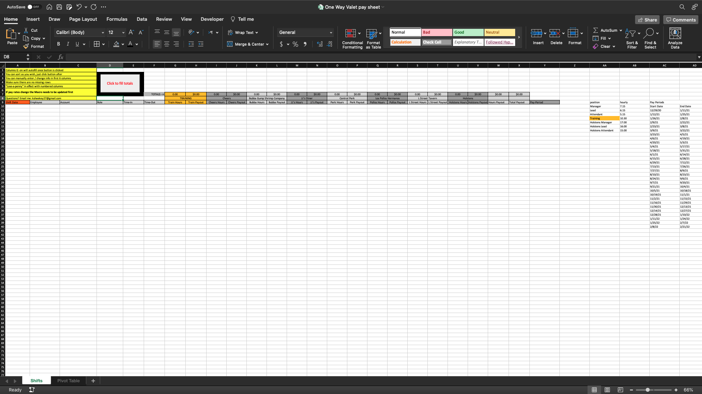
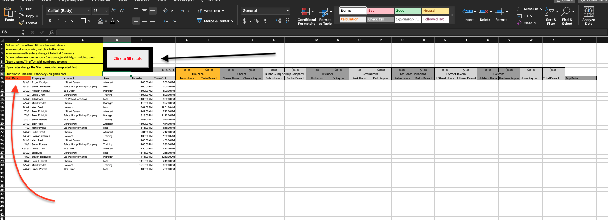
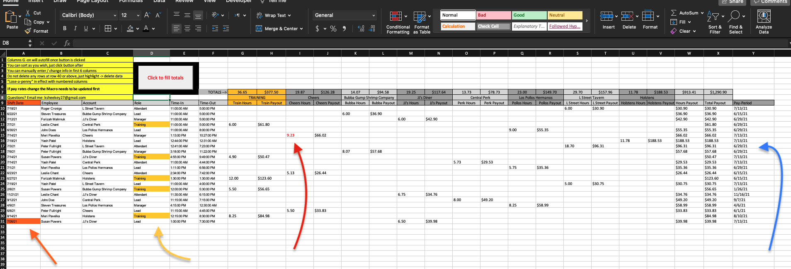

# OWV-VBA
VBA work for tracking payroll

This program is used in Microsoft Excel to streamline the Payroll operation.

This is a 3-step system from employee to site manager to payroll director.

In this instance, a QR code is generated and used for the employees to clock in and out of work. Those submissions go to a google forms doc with the necessary information needed to run and organzie the payroll in Excel.

Excel was the requested destination so a VBA script was created to make sure there was no code in any cells to avoid accidental mistakes or deletions of code. 

1. Employee scans QR and fill out shift information.
1. Manager audits then copies correct data from google forms and pastes onto Excel sheet, clicks button.
1. Payroll director refreshes pivot.

We pick up the process mid-Step.2

* The manager copies the data from google forms, columns needed are; 
    * Date - The date of the shift worked.
    * Employee - The employee who worked it.
    * Account (if applicable) - Which account that shift was worked at.
    * Role - The role of the employee (Attendant, Lead, Manager).
    * Time-In - Arrival Time.
    * Time-Out - Departure Time.

This is where we enter the VBA process.

The manager opens Excel and ENABLES MACROS! *important*

(What the sheet looks like when loaded with macros enabled)

The manager will then paste the google forms information in column A of the Excel sheet under the latest orange colored cell. (The orange colored cell always indicates the end of the last submission/paste). In this example the information would be pasted in cell A10 (orange arrow).

(What the sheet looks like with info pasted, prior to clicking the button)

After this the manager can run the totals by clicking the 'Click to fill totals' button on the top (black arrow above). This will auto generate all totals for the shifts worked. 

(What the sheet looks like after button is clicked)

* There are a couple cool features that happen once the button is clicked.
    * The totals filter into the correct column depending on what location they worked.
    * An orange cell color gets inserted at the last A cell to indicate end of submission and can be used as a reference for the next paste (orange arrow).
    * The training shifts (column D) get color-matched to the training totals for easy navigation (yellow arrow).
    * Stipulations can be put in, for example, Cheers should never have shifts of over 8 hours, so any instance of the total hours going above 8 will turn red in text (red arrow).
    * The last column (column Y) will use a Vlookup reference to filter on which pay period the shift was worked in for quick payouts (blue arrow).

The next time you want to add data to this sheet, start again at the cell directly under the latest A cell colored orange.(orange arrow)
